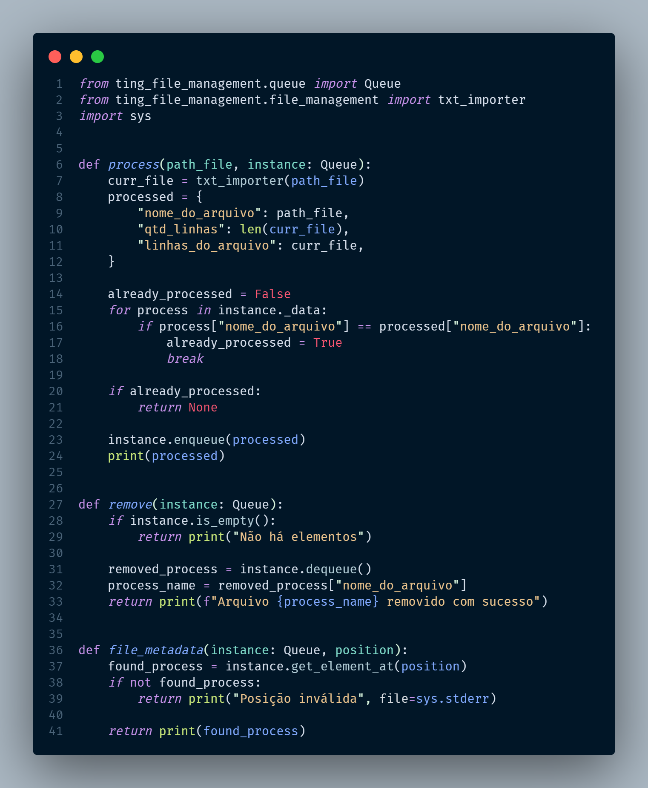

# 🐍 Trybe Is Not Google - TING



## 📘 Sobre

Um programa que simula um sistema de indexação de documentos, permitindo anexar e buscar arquivos de texto, aplicando conceitos de estruturas de dados como listas, pilhas, filas e manipulação de arquivos TXT.

## ⚛️ Ferramentas

- Python
- Pytest
- Algoritmos de busca e ordenação

## 🛠️ Como executar o projeto?

1. criar o ambiente virtual
```python3 -m venv .venv```
2. ativar o ambiente virtual
```source .venv/bin/activate```
3. instalar as dependências no ambiente virtual
```python3 -m pip install -r dev-requirements.txt```

## 📝 Nota


